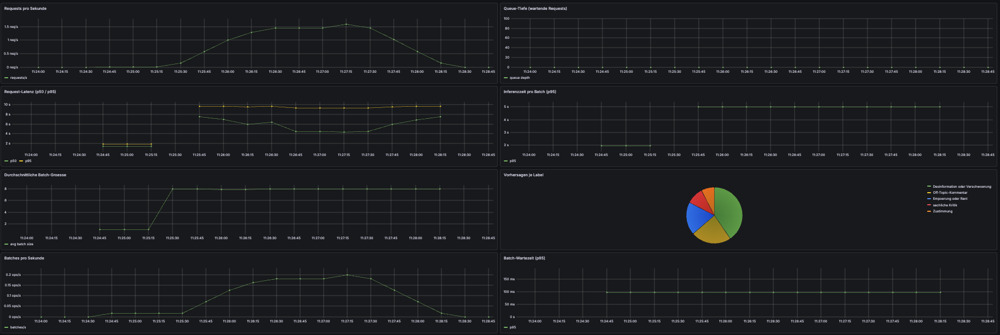

# NLP Operations Project

Zero-shot comment classification with microbatching, Prometheus, and Grafana.

## Goal

This project implements an HTTP service for classifying comments from a fictional online newspaper. The service uses a Hugging Face zero-shot classification pipeline with `facebook/bart-large-mnli`.

## Components

- FastAPI classifier service
- Microbatching for incoming classification requests
- Prometheus metrics
- Grafana dashboard
- Docker Compose setup
- Optional load generator

## Quickstart

```bash
uv sync                            # Install dependencies
uv run uvicorn app.main:app        # Start the service (downloads the model on first startup)
curl http://127.0.0.1:8000/health  # -> {"status":"ok"}
```

Classify a comment:

```bash
curl -s -X POST http://127.0.0.1:8000/classify \
  -H "Content-Type: application/json" \
  -d '{"comment": "This is complete nonsense, nobody believes these numbers."}'
```

## Microbatching

Concurrent `POST /classify` requests are grouped and sent through the model together. A batch is triggered as soon as `BATCH_MAX_SIZE` is reached **or** `BATCH_MAX_WAIT_MS` has elapsed since the first request in the batch. Both values can be configured via environment variables:

```bash
BATCH_MAX_SIZE=16 BATCH_MAX_WAIT_MS=50 uv run uvicorn app.main:app
```

Deterministic proof without downloading the model:

```bash
uv run python scripts/batching_demo.py   # e.g. batch sizes [16, 4]
```

## Metrics

Prometheus metrics are exposed under `GET /metrics`:

```bash
curl -s http://127.0.0.1:8000/metrics | grep '^nlpops_'
```

| Metric                              | Type      | Meaning                                                            |
| ----------------------------------- | --------- | ------------------------------------------------------------------ |
| `nlpops_classify_requests_total`    | Counter   | Number of incoming `/classify` requests                            |
| `nlpops_predictions_total{label}`   | Counter   | Number of predicted top labels per category                        |
| `nlpops_request_latency_seconds`    | Histogram | End-to-end request latency including queue wait time and inference |
| `nlpops_batch_size`                 | Histogram | Number of comments per processed model batch                       |
| `nlpops_inference_duration_seconds` | Histogram | Model inference duration per batch                                 |
| `nlpops_batches_processed_total`    | Counter   | Number of processed microbatches                                   |
| `nlpops_batch_wait_time_seconds`    | Histogram | Wait time from the first comment in a batch until joint processing |
| `nlpops_queue_depth`                | Gauge     | Current number of waiting requests in the microbatch queue         |

## Docker Compose

Starts the classifier, Prometheus, and Grafana together:

```bash
docker compose up -d            # Start the stack (downloads the model into the volume on first startup)
docker compose ps               # Status / health check
docker compose logs -f classifier-service
docker compose down             # Stop the stack
```

| Service            | URL                                                      | Purpose                                           |
| ------------------ | -------------------------------------------------------- | ------------------------------------------------- |
| classifier-service | [http://localhost:8000/docs](http://localhost:8000/docs) | API + `/metrics`                                  |
| prometheus         | [http://localhost:9090](http://localhost:9090)           | Scrapes `classifier-service:8000` every 5 seconds |
| grafana            | [http://localhost:3000](http://localhost:3000)           | Dashboard (admin/admin)                           |

The model is stored in the `hf-cache` volume and is only downloaded on the first startup.

## Dashboard & Load Test

The Grafana dashboard “NLP Operations - Classifier” is provisioned automatically. It includes panels for requests/s, queue depth, latency quantiles, inference time, batch size, label distribution, processed batches, and batch wait time.

Generate load and observe the dashboard at [http://localhost:3000](http://localhost:3000):

```bash
uv run python scripts/loadtest.py --url http://localhost:8000 --concurrency 8 --duration 120
```


